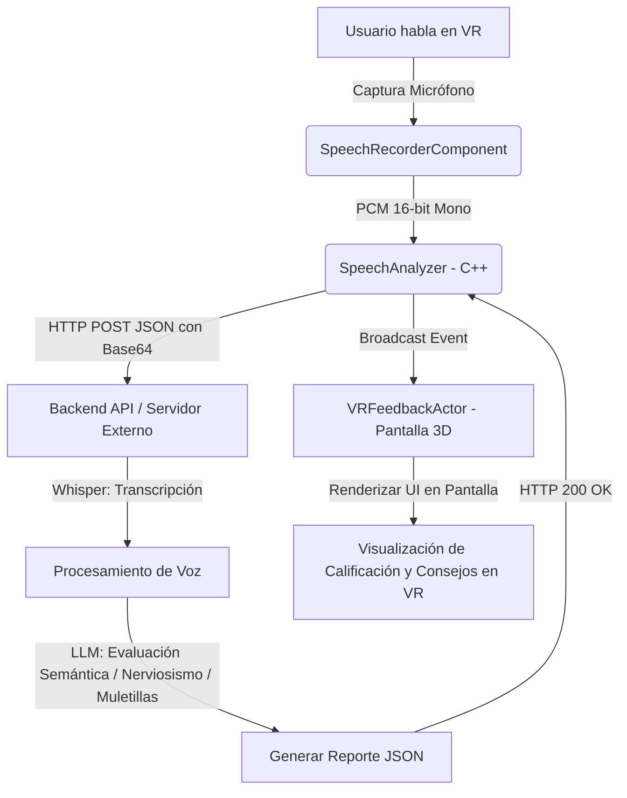

# MC Simulator - Inmersive VR Public Speaking Platform

**MC Simulator** es una plataforma inmersiva de entrenamiento en realidad virtual diseñada para entrenar y evaluar habilidades de oratoria y comunicación bajo escenarios de alta presión, optimizada específicamente para dispositivos **Meta Quest 2 / 3 / Pro** y desarrollada sobre **Unreal Engine 5**.

Este proyecto contiene el núcleo de arquitectura C++ y los archivos de configuración listos para ser montados en Unreal Engine.

---

## Estructura del Proyecto C++ Generado

El proyecto está organizado siguiendo las convenciones de Unreal Engine para un desarrollo limpio en C++ y Blueprints:

```text
MCSIMULATOR/
├── MCSIMULATOR.uproject         # Descriptor principal del proyecto (Módulos y Plugins de OpenXR/Audio)
├── .gitignore                   # Archivo de exclusiones de Git optimizado para Unreal
├── Config/                      # Ajustes del proyecto y optimizaciones para Meta Quest
│   ├── DefaultEngine.ini        # Renderizado Forward, MSAA 4x, Multi-View, permisos de audio y Vulkan
│   ├── DefaultInput.ini         # Habilitación de Enhanced Input
│   └── DefaultGame.ini          # Metadatos del proyecto y definición del GameMode base
└── Source/                      # Código C++ del Núcleo
    ├── MCSIMULATOR.Target.cs    # Configuración de compilación del juego ejecutable
    ├── MCSIMULATOREditor.Target.cs # Configuración de compilación para el Editor
    └── MCSIMULATOR/
        ├── MCSIMULATOR.Build.cs # Dependencias de módulos (Core, HTTP, Json, AudioCapture, AndroidPermission)
        ├── MCSIMULATOR.h / .cpp # Registro del módulo del juego
        ├── Public/ / Private/
        │   ├── MCSIMULATORGameMode # Asigna el Pawn de VR por defecto
        │   ├── VRCharacter         # Pawn del jugador VR (Cámara, Mandos Quest y solicitud de permisos de Mic)
        │   ├── SpeechRecorderComponent # Componente que captura voz del micrófono y la convierte a PCM 16-bit Mono
        │   ├── SpeechAnalyzer      # Cliente HTTP asíncrono para enviar audio en Base64 y procesar el feedback JSON
        │   └── VRFeedbackActor     # Actor 3D de la sala que dibuja la pantalla de feedback en el mundo virtual
```

---

## 🚀 Guía de Inicio Rápido (Montaje en Unreal Engine)

### 1. Requisitos Previos
*   **Unreal Engine 5 (v5.4 / v5.5 / v5.8 o superior)** instalado en Epic Games Launcher.
*   **Visual Studio 2022** con las cargas de trabajo de:
    *   *Desarrollo para el almacenamiento de escritorio con C++*
    *   *Desarrollo de juegos con C++*
    *   *Herramientas de Unreal Engine* (opcional pero recomendado)
*   **Android SDK & NDK** configurado en Unreal (necesario para compilar a Meta Quest/Android).

### 2. Generación de Archivos de Proyecto
1.  Abre la carpeta del proyecto en tu explorador de archivos.
2.  Haz clic derecho sobre el archivo `MCSIMULATOR.uproject`.
3.  Selecciona **Generate Visual Studio project files** (o ábrelo directamente en Rider / VS Code si lo prefieres).
4.  Abre el archivo `MCSIMULATOR.sln` generado.
5.  En Visual Studio, selecciona la configuración de compilación **Development Editor** y la plataforma **Win64**.
6.  Haz clic en **Compilar solución** (Build Solution) o pulsa `F5` para iniciar Unreal Editor con el proyecto compilado.

---

## 🎙️ Cómo Funciona el Flujo de Voz e IA

El sistema cuenta con un flujo de trabajo optimizado que evita sobrecargar el procesador del Meta Quest realizando el procesamiento en la nube o un servidor dedicado:



### Formato del API Request (Enviado por `SpeechAnalyzer`):
```json
{
  "audio_base64": "UklGRiS... (Cadena en Base64 de bytes de audio PCM de 16 bits a 16kHz Mono)",
  "context": "General",
  "sample_rate": 16000,
  "channels": 1
}
```

### Formato de Respuesta Esperada (JSON):
Para que la pantalla en VR dibuje los resultados correctamente, tu backend de procesamiento debe devolver un JSON con esta estructura:
```json
{
  "transcript": "Buenos días, hoy vengo a presentar mi tesis sobre...",
  "overall_score": 85.5,
  "coherence_score": 90.0,
  "filler_words_count": 4,
  "nervousness_feedback": "Tu ritmo fue constante, pero repetiste la palabra 'este' 4 veces al inicio. Intenta hacer pausas silenciosas en su lugar.",
  "semantic_feedback": "Explicación clara del problema técnico y terminología bien implementada. Buen dominio conceptual.",
  "recommendations": [
    "Reduce el uso de muletillas como 'este' o 'eh'.",
    "Haz más pausas de respiración entre secciones clave.",
    "Proyecta más seguridad al cerrar tus conclusiones."
  ]
}
```

---

## 🛠️ Configuración de Blueprints (Flujo Sugerido)

Una vez en Unreal Editor, se recomienda realizar el siguiente flujo para integrar la lógica de C++ con tus Widgets visuales en Realidad Virtual:

1.  **Crear el Widget de Pantalla (`W_FeedbackScreen`):**
    *   Crea un `UserWidget` de Blueprint.
    *   Diseña la interfaz (Título, cuadro de texto para transcripción, barra de porcentaje para el Score, cajas de texto para los comentarios y un panel de recomendaciones).
    *   Crea una función personalizada `UpdateUI(FSpeechAnalysisResult Data)`.
2.  **Heredar del Actor de Feedback (`BP_VRFeedbackActor`):**
    *   Crea un Blueprint Class heredado de `VRFeedbackActor`.
    *   En los detalles de su componente `WidgetComponent`, asigna la clase `W_FeedbackScreen` que creaste.
    *   Implementa el evento `OnAnalysisResultsReceived`. Obtén el Widget del componente (`GetUserWidgetObject`) y llama a `UpdateUI` pasándole la estructura `Results`.
3.  **Heredar del Pawn VR (`BP_VRCharacter`):**
    *   Crea un Blueprint heredado de `VRCharacter`.
    *   Asigna tus mallas 3D para las manos (en `LeftHandVisual` y `RightHandVisual`).
    *   Asigna tu `InputMappingContext` y las `InputActions` de Enhanced Input (como Grab y Trigger) creadas en el Content Browser.
    *   *Flujo del Micrófono:* Puedes programar que al mantener presionado el Trigger del control Quest, llame a `SpeechRecorder->StartRecording()` y al soltarlo llame a `SpeechRecorder->StopRecording()`.
    *   *Flujo de Análisis:* Vincula el evento del grabador `OnRecordingStopped` para que llame a `SpeechAnalyzer->RequestSpeechAnalysis(RawPCMData)`.
    *   *Flujo de Visualización:* Vincula el evento de tu analyzer `OnAnalysisCompleted` para que busque los actores de `BP_VRFeedbackActor` en la escena y llame a `DisplayAnalysisResults(Result)`.

---

## 📦 Despliegue y Distribución para Meta Quest

Para poder empaquetar el APK y ejecutarlo en el Quest:

1.  **Habilitar modo Desarrollador:**
    *   Asegúrate de que tu visor de Meta Quest esté en modo desarrollador a través de la aplicación Meta Horizon.
2.  **Configurar Android SDK en Unreal:**
    *   En Unreal Editor, ve a `Edit -> Project Settings -> Platforms -> Android SDK`.
    *   Establece las rutas correctas para el SDK de Android, NDK y JDK.
3.  **Aceptar Licencias de Android SDK:**
    *   Ve a `Project Settings -> Platforms -> Android`.
    *   En la sección de firma e instalación, haz clic en **Configure Now** en la configuración de la plataforma Android y acepta los acuerdos de licencia de SDK si aparecen en rojo.
4.  **Empaquetado (Packaging):**
    *   Ve a `Platforms -> Android -> Package Project` (selecciona formato **Android (ASTC)**).
    *   Esto generará un archivo `.apk` y un script de instalación `.bat`.
    *   Conecta el Meta Quest a la computadora mediante USB-C y ejecuta el script `.bat` para instalar el simulador directamente en el visor.
5.  **Decisión Comercial de Distribución:**
    *   **Meta Quest App Lab (Recomendado para iniciar):** Permite subir el juego a la tienda oficial de Meta sin las exigencias extremas de curación de la tienda principal. Los usuarios pueden comprarlo o instalarlo mediante un enlace directo.
    *   **Venta directa de APK (B2B / Corporativo):** Ideal para empresas. Puedes vender el APK empaquetado directamente y realizar la instalación en lote con herramientas como **SideQuest** o sistemas de MDM corporativos (Mobile Device Management) como **ArborXR** o **ManageXR**.
